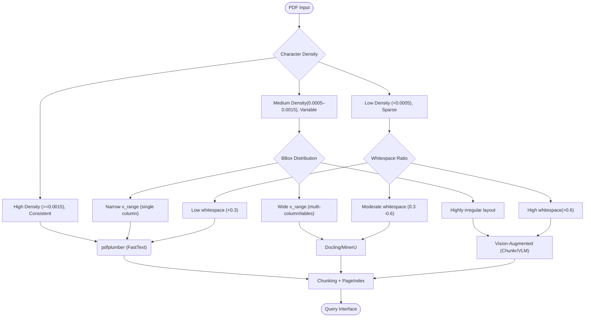

# Domain Notes —  The Document Intelligence Refinery

## 1. Extraction Strategy Decision Tree

- **FastText (pdfplumber)**  
  - **Use when:** native PDFs, simple layouts, text-heavy documents.  
  - **Failure risk:** collapses multi-column text into a single stream (*structure collapse*).  
  - **Cost tier:** Low.  

- **Layout-Aware (Docling / MinerU)**  
  - **Use when:** tables, multi-column layouts, structured reports.  
  - **Failure risk:** loses semantic relationships if layout parsing fails (*context poverty*).  
  - **Cost tier:** Medium.  

- **Vision-Augmented (Chunkr / VLMs)**  
  - **Use when:** scanned PDFs, images, figures, OCR-heavy documents.  
  - **Failure risk:** weaker provenance if bounding boxes are lost (*provenance blindness*).  
  - **Cost tier:** High.

---

## 2. Observed Failure Modes

- **Structure Collapse:**  
  Example: pdfplumber flattens multi-column text into a single stream.  

- **Context Poverty:**  
  Example: Docling extracts words but loses table relationships.  

- **Provenance Blindness:**  
  Example: OCR output without bounding boxes loses source traceability.  

---

## 3. Pipeline Diagram (Decision Tree)

---

## 4. Comparative Notes

| Tool | Output Characteristics | Strengths | Weaknesses | Failure Modes Avoided | Cost Tier | Typical Corpus Class |
| ------ | ------------------------ | ----------- | ------------ | ----------------------- | ----------- | ---------------------- |
| **pdfplumber (FastText)** | Raw character stream with bounding boxes | Fast, lightweight, precise glyph positions | Flattens multi‑column layouts; tables broken into strings | Avoids *provenance blindness* (keeps positions), but risks *structure collapse* | Low | Financial reports, simple native PDFs |
| **Docling (Layout‑Aware)** | Word/block‑level elements, structured tables, figures | Preserves reading order; extracts tables as JSON; layout fidelity | Slower, heavier; may lose context if chunking is naive | Avoids *structure collapse* and reduces *context poverty* | Medium | Technical assessments, table‑heavy fiscal reports |
| **Vision‑Augmented (Chunkr/VLM)** | OCR + vision models; image‑aware extraction | Handles scanned PDFs, figures, charts; recovers text from images | Computationally expensive; OCR errors possible; weaker provenance | Avoids *provenance blindness*; handles *context poverty* in image‑heavy docs | High | Scanned legal documents, design‑rich reports |

---

## 5. Key Takeaways

- **Native PDFs (financial reports)** → pdfplumber is efficient and low-cost.  
- **Complex layouts (multi-column, tables)** → Docling/MinerU provide better fidelity at medium cost.  
- **Scanned/image-heavy docs (legal, design-rich)** → Vision-augmented extraction is necessary despite higher cost.  
- **Confidence scoring + escalation guards** ensure fallback when failure modes are detected.  
