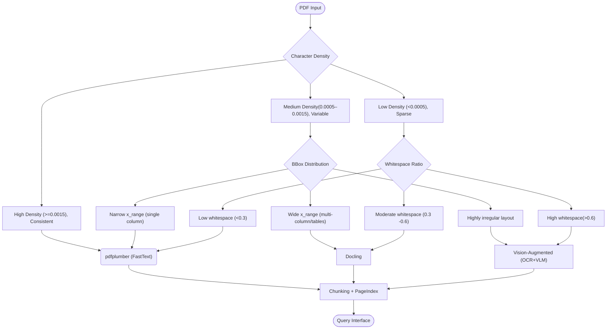

# Document Intelligence Refinery

[](https://github.com/nuhaminae/Document-Intelligence-Refinery/actions/workflows/CI.yml)


## Project Review

The **Document-Intelligence-Refinery** is a modular, containerized pipeline for intelligent PDF document processing. It classifies documents into corpus classes, routes them to the most suitable extraction strategy, and logs provenance for auditability. The system combines lightweight heuristics, layout‑aware parsing, OCR vision extraction, and fact/vector ingestion to handle diverse document types ranging from simple digital PDFs to scanned, image‑heavy reports and numeric tables.

The pipeline is fully Dockerized, reproducible, and demo‑ready. It supports both **batch runs** (pipeline service) and **interactive querying** (FastAPI query agent exposed at `localhost:8000`).

---

## Key Feature

- **Corpus Coverage**: Representative files selected from each class (least chunk size):
  - Class A (native text): `CBE Annual Report 2012-13.pdf`
  - Class B1 (scanned/image-based): `Security_Vulnerability_Disclosure_Standard_Procedure_1.pdf`
  - Class B2 (scanned/image-based) (Amharic): `2013-E.C-Audit-finding-information.pdf`
  - Class C (mixed text + tables): `20191010_Pharmaceutical-Manufacturing-Opportunites-in-Ethiopia_VF.pdf`
  - Class D (table-heavy numeric): `Consumer Price Index March 2025.pdf`

- **Triage Agent**: Computes metrics (character density, whitespace ratio, bounding box distribution, image ratio) and classifies documents into profiles.

- **Extraction Router**: Selects the appropriate strategy (FastText, LayoutAware, VisionAugmented) and escalates if confidence is low.

- **Strategies**:  
  - *FastTextExtractor*: Uses pdfplumber for native, single‑column PDFs.  
  - *LayoutExtractor*: Uses Docling for multi‑column, table‑heavy, or figure‑heavy PDFs.  
  - *VisionExtractor*: Uses LayoutLMv3 + OCR (pytesseract) for scanned/image‑heavy documents.  

- **Fact Extraction & Vectorization**:  
  - Facts stored in SQLite (`facts.db`).  
  - Embeddings stored in ChromaDB (`vector_store`).  

- **Audit Agent**: Verifies extracted claims against source provenance.  

- **Query Agent**: FastAPI interface for semantic search, page index navigation, and fact retrieval.  

- **Provenance Tracking**: Every extracted Logic Document Unit (LDU) is logged with its source, transformations, and confidence.  

- **Ledger & Profiles**: Outputs JSON profiles and an extraction ledger for reproducibility and auditing.  

- **Dockerization**:  
  - Individual services for each agent.  
  - Unified `pipeline` service for sequential runs.  
  - Query agent exposed at `http://localhost:8000` for demo.  

---

## Table of Contents

- [Document Intelligence Refinery](#document-intelligence-refinery)
  - [Project Review](#project-review)
  - [Key Feature](#key-feature)
  - [Table of Contents](#table-of-contents)
  - [Project Structure (Snippet)](#project-structure-snippet)
  - [Installation](#installation)
    - [Prerequisites](#prerequisites)
    - [Setup](#setup)
  - [Usage](#usage)
    - [Batch Pipeline Run](#batch-pipeline-run)
    - [Individual Agent Runs](#individual-agent-runs)
    - [Query Agent (Interactive)](#query-agent-interactive)
  - [Extraction Strategy Decision Tree](#extraction-strategy-decision-tree)
  - [Escalation Strategy](#escalation-strategy)
  - [Extraction Cost Estimation](#extraction-cost-estimation)
  - [Dockerization](#dockerization)
  - [Project Status](#project-status)

---

## Project Structure (Snippet)

```bash
Document-Intelligence-Refinery/
├── src/
│   ├── agents/
│   │   ├── extractor_rubric_config.py
│   │   ├── extract_docs.py
│   │   ├── chunker.py
│   │   ├── indexer.py
│   │   ├── fact_extractor.py
│   │   ├── vector_ingestor.py
│   │   ├── audit_agent.py
│   │   └── query_agent.py
│   ├── strategies/
│   │   ├── fasttext_extractor.py
│   │   ├── layout_extractor.py
│   │   └── vision_extractor.py
│   └── utils/
│       └── preprocessor.py
├── tests/
├── data/
├── .refinery/
├── rubric/
├── Dockerfile
├── docker-compose.yml
└── README.md
```

---

## Installation

### Prerequisites

- Python 3.12  
- Git  
- Docker & Docker Compose  

### Setup

```bash
# Clone repo
git clone https://github.com/nuhaminae/Document-Intelligence-Refinery.git
cd Document-Intelligence-Refinery

# Build Docker image
docker-compose build
```

---

## Usage

### Batch Pipeline Run

```bash
docker-compose run --rm pipeline
```

### Individual Agent Runs

```bash
docker-compose run --rm preprocessor
docker-compose run --rm extractor_rubric_config
docker-compose run --rm extract_docs
docker-compose run --rm chunkr
docker-compose run --rm indexer
docker-compose run --rm fact_extractor
docker-compose run --rm vector_ingestor
docker-compose run --rm audit_agent
docker-compose run --rm query_agent
```

### Query Agent (Interactive)

```bash
docker-compose up query_agent
```

Open `http://localhost:8000` to query facts interactively.

**Outputs**:  

- Profiles → `.refinery/profiles/*.json`  
- Ledger → `.refinery/extraction_ledger.jsonl`  
- Facts → `.refinery/facts.db`  
- Vectors → `.refinery/vector_store/`  
- Index → `.refinery/pageindex/`  

---

## Extraction Strategy Decision Tree



---

## Escalation Strategy

The router uses **triage metrics** (character density, whitespace ratio, image area ratio, font metadata, layout complexity) to decide the initial strategy:

- **FastText (pdfplumber)** → chosen if:
  - High character density (`>0.001` chars per page area).  
  - Low whitespace (`<0.5`).  
  - Fonts are embedded and origin type is digital.  
  - Image ratio is low (`<0.3`).  
  → Best for clean, native PDFs.

- **Layout‑Aware (Docling)** → chosen if:
  - Layout complexity is multi‑column or table‑heavy.  
  - Or density is medium (`~0.0005`) with structured layouts.  
  → Best for reports with tables, figures, multi‑column text.

- **Vision/OCR (pytesseract + LayoutLMv3)** → chosen if:
  - Density is very low (`<0.0005`).  
  - Whitespace ratio is high (`>0.6`).  
  - Image area ratio is high (`>0.3`).  
  - Or FastText/Layout confidence is low.  
  → Best for scanned/image‑based PDFs.

**Escalation policy:**  

- Start with the cheapest/fastest strategy.  
- If extraction confidence < 0.75, escalate:  
  - FastText → Layout → Vision.  
- Vision is the “last resort” because it’s slower and more costly (OCR + transformer).

---

## Extraction Cost Estimation

The router estimates cost using a simple token‑based formula:

1. **Token count**:  
   - It serialises the extracted document JSON (`json.dumps(extracted_doc.model_dump())`).  
   - Divides length by 4 to approximate token count.  

2. **Cost per token**:  
   - `(tokens / 1000) * 0.01` USD.  
   - So ~1 cent per 1,000 tokens.  

3. **Budget guard**:  
   - Max cost per document = **$0.50**.  
   - If escalation is needed but cost would exceed this, it won’t escalate further.  

This ensures extraction stays cheap and predictable, while still escalating when confidence is low.

**Approach:**

| Corpus Category | Extraction Strategy | Extraction Confidence | cost estimate |
| -- | --- | -- | -- |
| Class A | Vision Augmented | 0.6 | {"tokens": 8756, "runtime_sec": 44.71, "usd": 0.0876} |
| Class B1 | Vision Augmented | 0.6 | {"tokens": 7035, "runtime_sec": 46.09, "usd": 0.0704} |
| Class B2 | Vision Augmented | 0.6 | {"tokens": 2022, "runtime_sec": 8.12, "usd": 0.0202} |
| Class C | Vision Augmented | 0.75 | {"tokens": 3705, "runtime_sec": 39.94, "usd": 0.037} |
| Class D | Vision Augmented | 0.6 | {"tokens": 5268, "runtime_sec": 27.54, "usd": 0.0527} |

---

## Dockerization

- **Dockerfile**: Defines environment (Python 3.12, OCR, dependencies).  
- **docker-compose.yml**: Defines services for each agent and unified `pipeline`.  
- **Exposed Query Agent**: Accessible at `http://localhost:8000`.

---

## Project Status

The project is completed. Check the [commit history](https://github.com/nuhaminae/Document-Intelligence-Refinery/).
